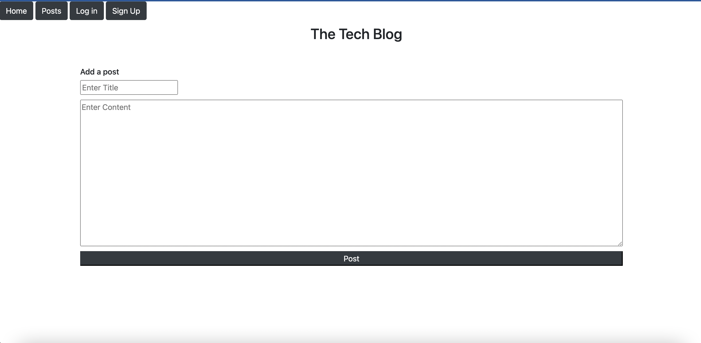

# ideal-tech-blog

# Description
Upon visiting the site, the user can sign up and log in to their account. They will be able to fill in their email and password as well as their name. Aftr logging in, the user can see the dashboard containing the blog posts and comments.

Devlopers can publish their blog posts and comments onto other developers' posts. The user can simply log out but clicking the button that correlates with that notion.

# Screenshots

# Links

GitHub Repo Link: https://github.com/bilalfarrukh2000/ideal-tech-blog
Deployed Heroku Link: https://ideal-tech-blog.herokuapp.com/